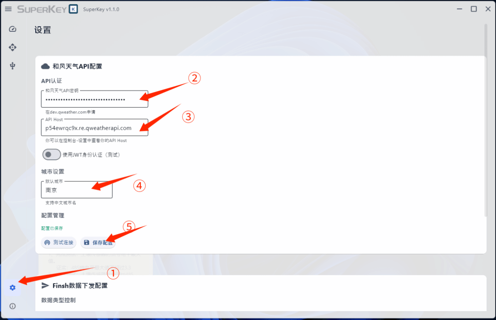
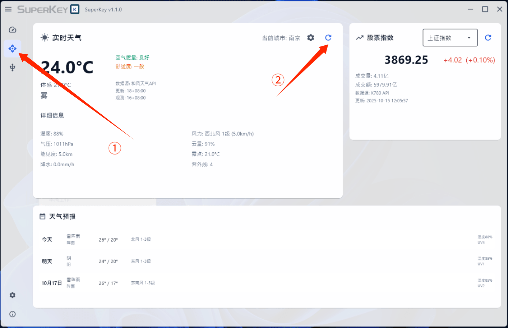
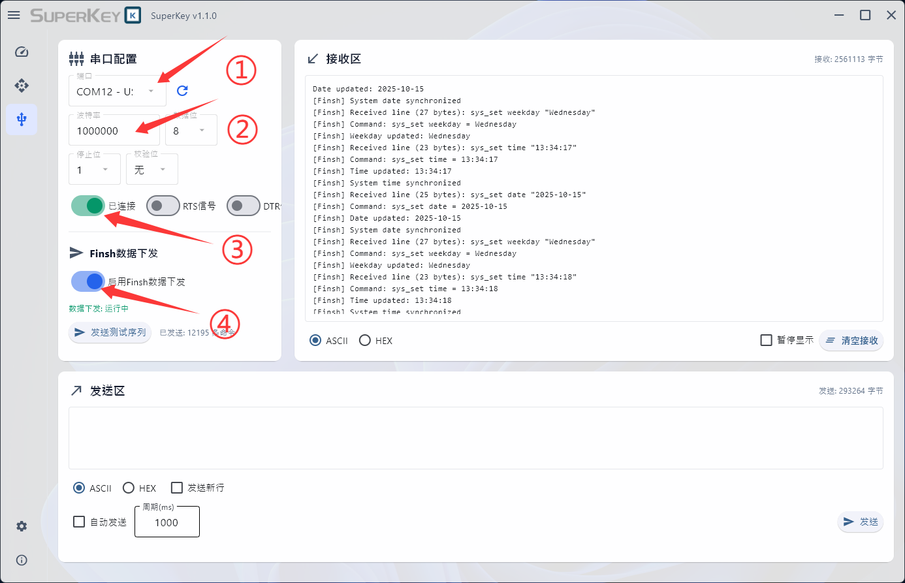
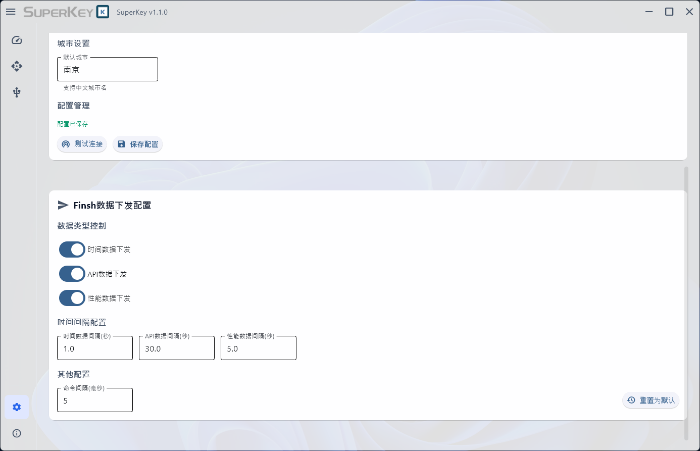

## 功能特性

- 硬件监控: 实时监控CPU、GPU、内存、磁盘、网络状态
- 天气信息: 支持和风天气API，提供实时天气和预报数据
- 股票行情: 集成第三方API，显示主要股指信息
- 串口调试: 完整的串口通信工具，支持ASCII/HEX格式
- 数据下发: 自定义Finsh协议，向外部设备发送监控数据
- 现代UI: 基于Flet框架，支持Windows Mica/Acrylic视觉效果
- 一键构建: 支持打包成独立EXE文件，无需Python环境

## 快速开始
- 克隆仓库
```
git clone https://github.com/OpenSiFli/SuperKeyHub
```
### 环境要求
- Windows 10/11 (推荐)
- Python 3.7+
- .NET Framework 4.7.2+

### 环境安装/构建与快速使用
```bash
cd SuperKeyHub
```
- 仅安装环境
```bash
python setup_dependencies.py
python main.py
```
- 开发者模式（包含构建工具）
```bash
python setup_dependencies.py --dev
python main.py
```
- 仅构建
```bash
python setup_dependencies.py --build-only
```
#### 快速使用方法
- 1. 转到设置界面，在“和风天气API配置”页面中进行API密钥、API HOST字段的填写，并填写城市名称，最后点击保存配置。

随后点击信息显示页面，点击实时天气板块内的刷新按钮以刷新出正确的天气数据。股票API默认载入，不需要再配置。

- 2. 将SuperKey通过USB连接到电脑，转到串口配置页面，选择SuperKey的串口号。（若没有，尝试点击串口号旁边的刷新按钮，刷新出SuperKey的串口号）。
- 3. 正确配置波特率1000000，点击连接，并点击数据下发按钮。稍等片刻，信息将同步至SuperKey屏幕。

- 4. 若觉得数据更新不及时，则可以在设置页面下拉找到Finsh数据下发配置，通过配置更短的数据下发时间间隔。



## 注意事项
- SuperKey 1.0版本适配SuperKey固件1.0版本。