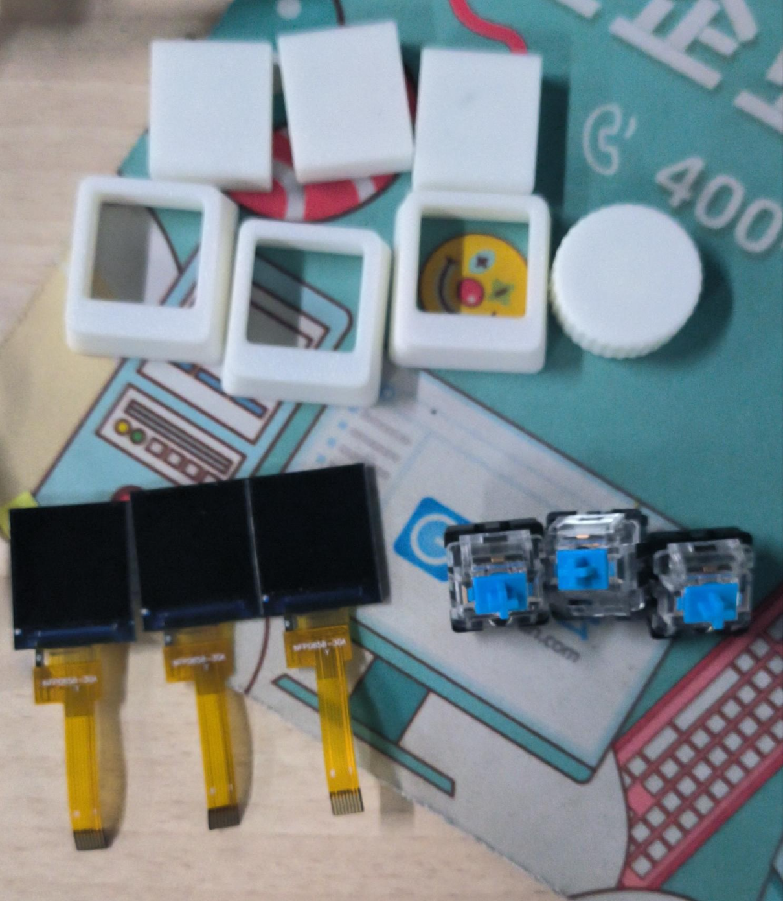
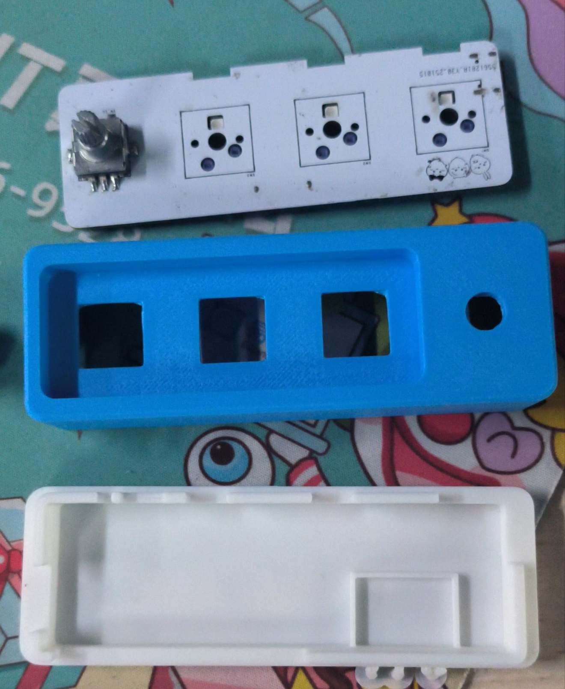
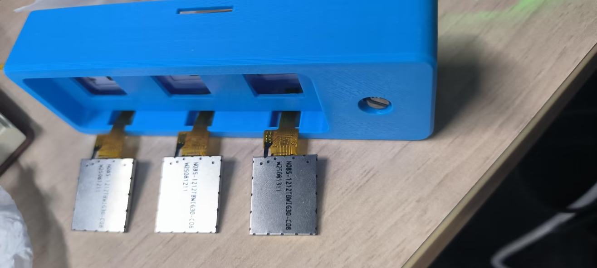
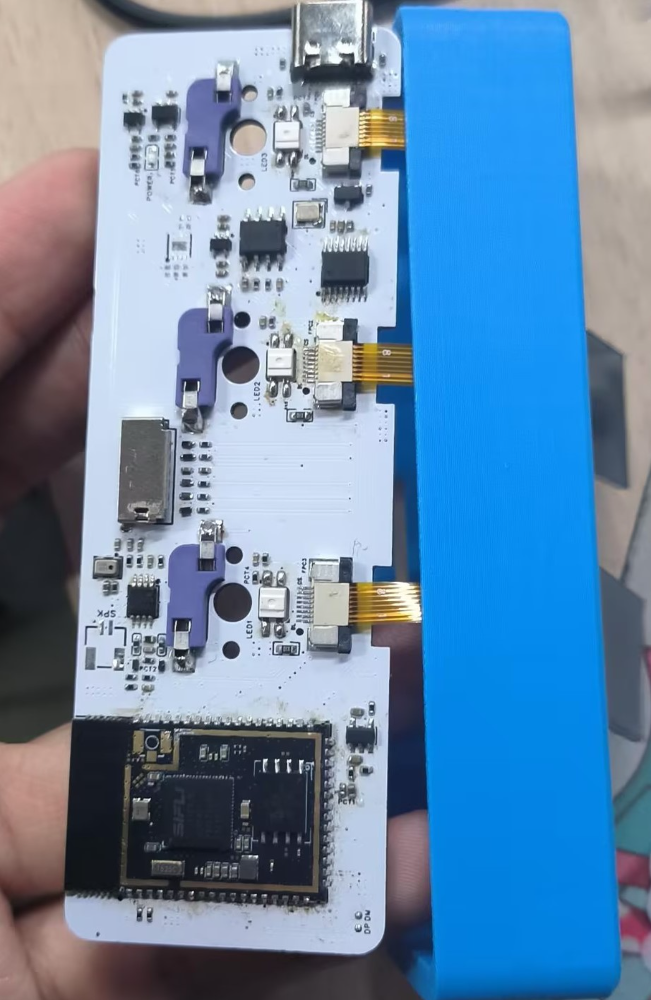
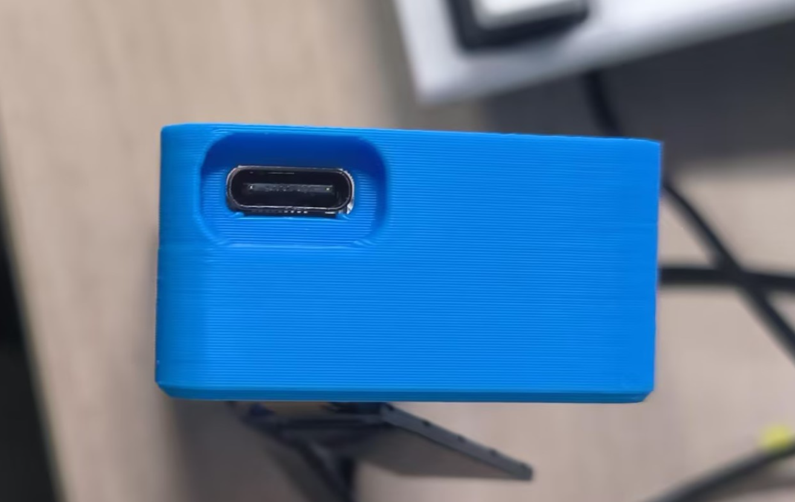
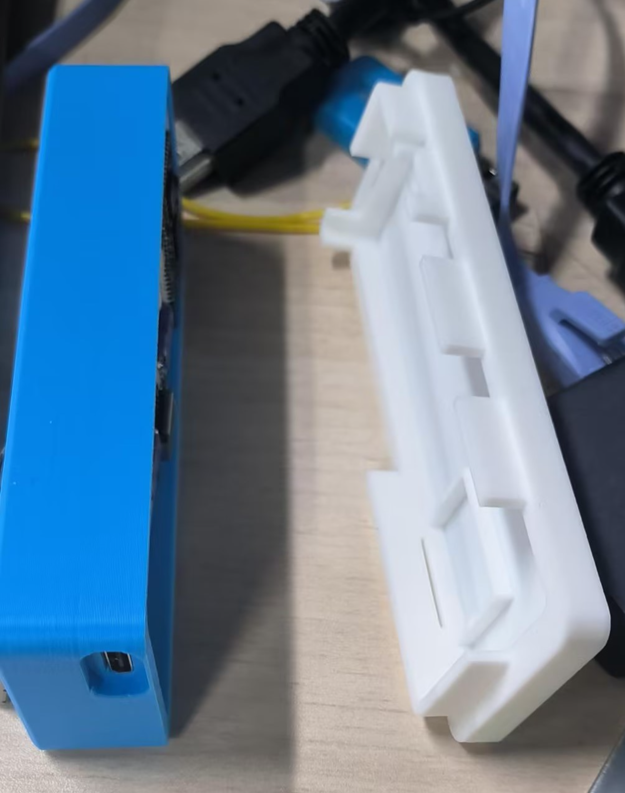
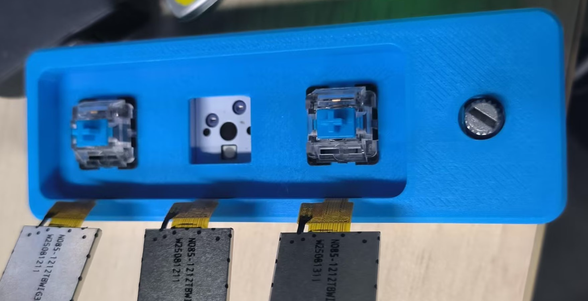
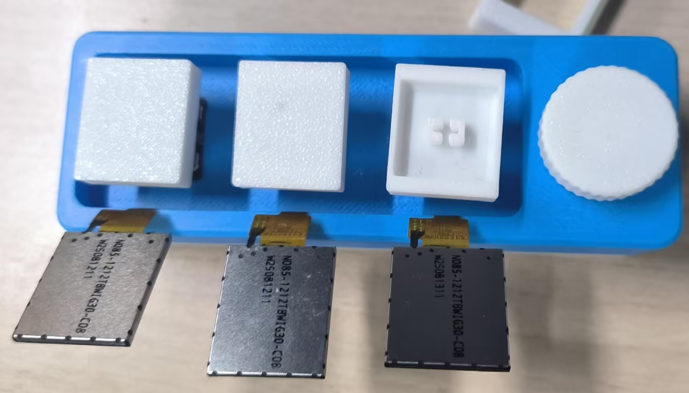
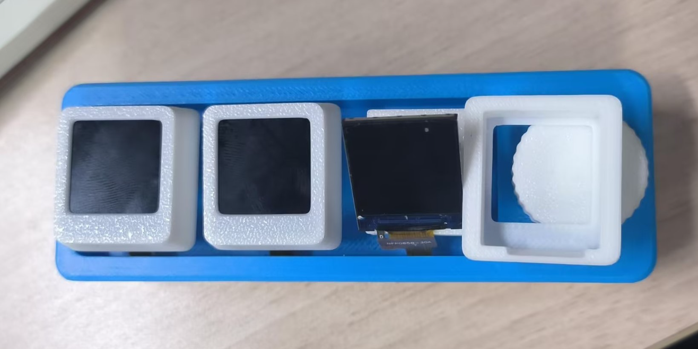
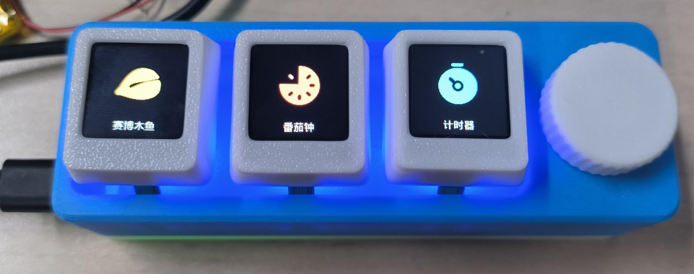

## 主流程
`显示屏 -> 底座 -> 按键轴 -> 键帽/旋钮 -> 完成`

## 硬件清单
1. 组成键帽的盖子、底座x3
2. 旋钮盖
3. 显示屏x3
4. 键轴x3
5. PCB板
6. 外壳及底板

## 安装
### 屏幕安装
1. 将显示屏接口穿过外壳上的过孔，然后接到PCB上

2. 将控制板与外壳如下垂直放置更方便安装

### 底座安装
1. 将USB口对上外壳槽口处，

2. 底座对接方向如下图所示

### 安装键轴
1. 对准孔位，直接按入即可

### 安装键帽/旋钮
1. 先插上座子，方向如下

2. 然后盖上帽子，方向如下

## 完成
